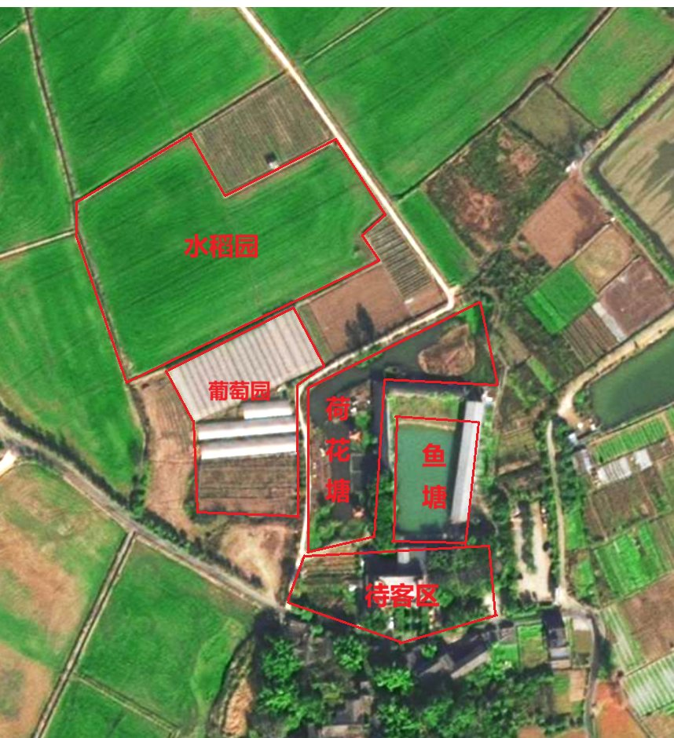

# 🏞️ 宝胜村数字孪生三维实景（写实农业风版）

> 四川商务职业学院信息技术系 · **IT助农队** 三下乡实践 · 成都市龙泉驿区宝胜村
> 依据宝胜村实地航拍分布图与各区域实景照片，1:1 还原村域「种植—水系—人文」空间布局的三维可交互动态数字孪生界面。

---

## 🎨 实景化视觉体系（实地照片纹理驱动）

整体视觉以**实地拍摄照片作为三维纹理**驱动，最大程度还原真实村貌：

| 元素 | 实景化处理 |
| --- | --- |
| 水稻园 | 「水稻园.png」实景稻田照片直接作为区域地面纹理 + 3D 立体稻束点缀 |
| 葡萄园 | 「葡萄园.jpg」棚内实景照片铺底 + 半透明拱棚薄膜罩体 |
| 荷花园 | 「荷花园.jpg」荷塘亭栈实景照片铺底 + 3D 六角观景亭 |
| 鱼塘 | 「鱼塘1.jpg」实景水面照片铺底 + **半透明动态波光层**（粼粼波纹流动） |
| 待客区 | 「待客区1.jpg」竹艺长廊实景照片铺底 + 3D 竹屋/茅草亭/祈福树/队旗 |
| 天空 | 渐变穹顶（天顶蓝 → 地平线暖白），替代纯色卡通天 |
| 色彩 | 渲染管线启用 sRGB 色彩空间，照片色彩真实还原；暖阳 + 柔雾 |
| 照片加载 | 5 张实景照片经压缩后以 base64 内嵌 HTML（**file:// 离线打开同样正常显示**） |

---

## 🗺️ 村域空间布局（依据实测分布图）

| 方位 | 区域 | 类型 | 布局依据 |
| --- | --- | --- | --- |
| 北 | **水稻园** | 连片稻田种植区 | 分布图中最大田块 |
| 西 | **葡萄园** | 钢架大棚种植区 | 白色大棚阵列 |
| 中 | **荷花园** | 观光水景区 | 荷塘 + 六角凉亭 + 木栈道 |
| 中东 | **鱼塘** | 水产养殖区 | 长条形水塘，护栏环绕 |
| 南 | **待客区** | 乡村接待区 | 竹艺茅草亭、茶座、祈福树 |
| 东南 | **锦家祠** | 人文地标 | 村落祠堂建筑 |

---

## 🛣️ 村道行走路网

按分布图道路走向铺设 **8 段可行走道路**（南北主路 + 横路 + 东绕段 + 西支路 + 东支路 + 鱼塘南支路 + 支路F），构成 9 节点路网，道路颜色与整体写实农业风统一。

---

## 👥 数字人系统

### 🚶 董老师第一视角化身
- 点击顶部「🚶 董老师第一视角」按钮，**董老师的数字人化身进入第一视角**：
  - 屏幕左下方弹出**董老师画中画形象卡**（数字人形象照 + 状态提示）；
  - 3D 场景中可见董老师的**红色 IT助农队马甲身躯与双臂**（胸前队标清晰，行走时摆臂、身体起伏）；
- **方向键 / WASD** 控制董老师行走，**Q/E** 升降高度，**鼠标拖动**转头；
- 环绕视角下的方向键左右平移方向已校准。

### 👨‍🌾 七名学生队员动态行走
**江子杰、范思哲、李汶励、杨欣洁、李静、唐婉怡、田琪铭** 七名队员以 3D 数字人形象出现在村道上：

- 统一红色 IT助农队马甲（胸前队标）+ 各自发型/裤装配色差异，头顶绿色系姓名标签；
- **沿路网动态随机行走**：行走至路口随机选择下一步方向（优先不折返），腿臂摆动、朝向平滑转向，速度各不相同；
- **鼠标可自由拖动任意队员到任意位置**（拖动中同样显示方向箭头与距离），松手后队员自动走回最近道路继续巡逻；
- 单击队员可查看其姓名、职责简介与个人数字人形象照；
- 「↩️ 复位布局」可将队员重新均匀放回七条道路。

---

## 🎮 操作指南

| 操作 | 效果 |
| --- | --- |
| 🖱️ **左键拖动园区/建筑/队员** | 移动位置（拖动中显示方向箭头 + 起点落点标记 + 方位距离 HUD） |
| 👆 **单击区域或队员** | 弹出信息面板：3D 农业风名称、简介、实景照片、坐标 |
| 🔄 **左键空白处拖动** | 旋转视角 |
| 🔍 **滚轮** / 🖱️**右键拖动** | 缩放 / 平移视图 |
| ⌨️ **方向键 / WASD** | 环绕模式平移视图；第一视角下控制董老师行走（Q/E 升降） |
| ⌨️ **Esc** | 关闭弹窗 / 面板 |

**工具栏**：🗺️ 区域分布图（高清/卫星/2D 三视图）｜🏷️ 标签开关 ｜🚶 董老师第一视角切换 ｜↩️ 复位布局

---

## ✨ 动态效果清单

- 🌊 荷塘/鱼塘水面顶点级波纹起伏
- 🎗️ 祈福树 52 条红绸随风摆动（两棵树）
- 🚩 IT助农队队旗顶点级迎风飘动
- 👨‍🌾 7 名队员沿路网持续行走（摆臂迈腿 + 随机转向）
- ☁️ 天空云朵缓慢漂移
- 🏷️ 区域/队员 3D 立体标签悬浮微动（红绿农业风四层字效）
- 🚶 董老师第一视角行走手臂摆动

---

## 🧰 技术架构

| 层级 | 实现 |
| --- | --- |
| 渲染引擎 | Three.js r128（本地化 `three.min.js`，离线可打开，无本地文件时自动回退 CDN） |
| 场景建模 | 程序化参数建模（40+ 组几何体：稻田/拱棚/荷塘/鱼塘/竹屋/祠堂/树木等） |
| 数字人 | 参数化人体骨架（髋/肩枢轴 + 走路摆动动画），队员 7 具 + 董老师第一视角化身 |
| 路网行走 | 9 节点 8 边图结构 + 参数化插值行走 + 路口随机转向 + 最近边投影吸附 |
| 交互拾取 | Raycaster 射线拾取 + 水平面求交实现建筑/队员地面拖拽 |
| 文字标签 | Canvas 四层渲染（投影层/描边/渐变填充/高光）+ Sprite 面向相机 |
| 视角系统 | 球坐标环绕相机 + 第一人称行走模式（角色化身跟随） |
| 光影 | 暖色平行光 PCFSoft 阴影 + 半球光 + 环境光 |

---

## 📁 文件依赖清单（需与 HTML 保持同目录）

| 文件 | 用途 |
| --- | --- |
| three.min.js | Three.js 渲染引擎（本地化） |
| 区域高清分布图.png / 区域分布卫星图.png / 区域分布2D图.png | 分布图弹窗三视图 |
| 水稻园.png / 葡萄园.jpg / 荷花园.jpg / 鱼塘1.jpg / 鱼塘2.jpg | 各区域实景照片 |
| 待客区1~4.jpg | 待客区实景照片 |
| 江子杰/范思哲/李汶励/杨欣洁/李静/唐婉怡/田琪铭.png | 队员个人形象照（点击队员显示） |
| 宝胜村数字孪生.html | 数字孪生页面本体 |

> 整个文件夹拷贝即可离线使用；后续可将 `宝胜村数字孪生.html` 通过 iframe 嵌入主网页底部的「数字孪生效果展示」预留区。

---

## 🌾 建设背景

2026 年 7 月，四川商务职业学院信息技术系 **IT助农队** 赴成都市龙泉驿区 **宝胜村** 开展暑期"三下乡"社会实践活动。团队围绕葡萄品质智能分析智能体、STM32 土壤监测、数字孪生与数字人科普等方向开展助农服务，本数字孪生界面即团队为宝胜村搭建的村域数字化展示成果之一。

---

*宝胜村数字孪生 · IT助农队 · 科创竞赛项目*
