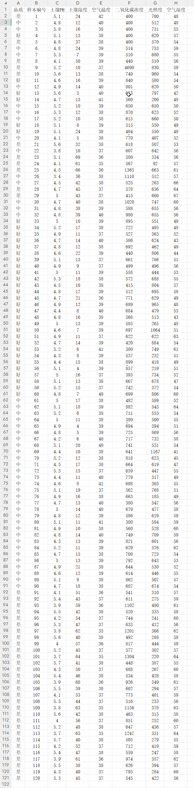
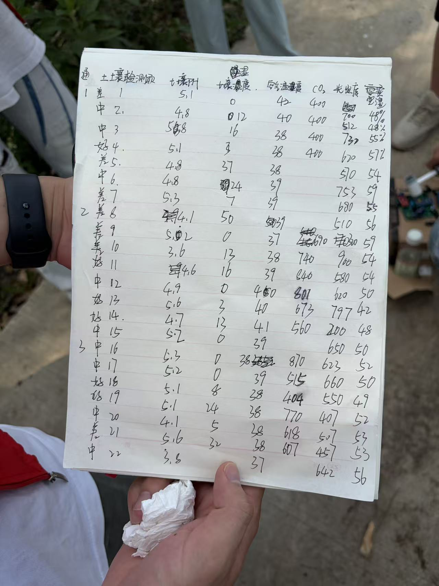
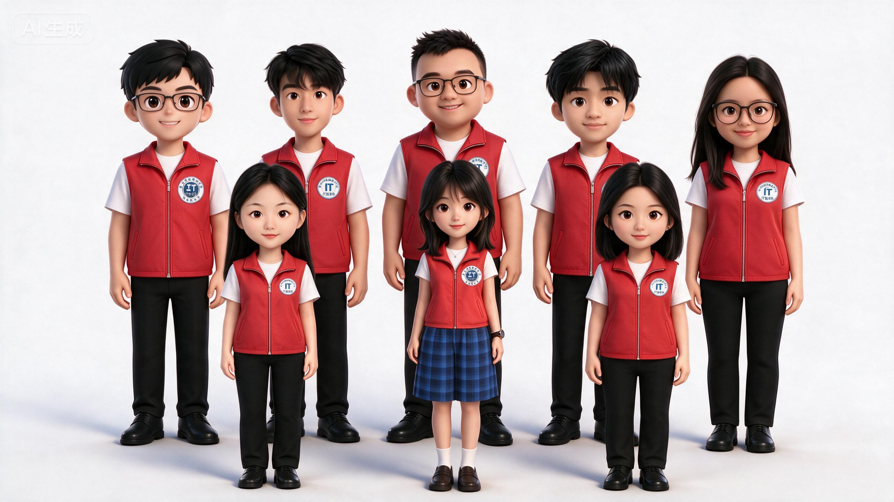

# 🍇 葡萄园葡萄品质智能分析系统

> 基于 AI 大模型与多源数据融合，实现葡萄图像识别分级 + 环境因子综合评估，输出精准种植管护方案

---

## 📋 项目简介

本项目构建葡萄果园智能分析智能体，融合葡萄园环境数据集与葡萄实物图片知识库。通过图像识别技术快速判定葡萄外观品质，结合土壤、温湿度、光照、CO₂ 等环境因子进行多维度综合校验，最终输出针对性的果园种植管护优化建议，助力葡萄种植提质增效，推动智慧农业发展。

**核心技术标签：**

`扣子AI智能体` `图像识别分级` `多因子环境分析` `智慧种植决策` `知识库双库融合`

### 🎬 数字人视频

网页在「项目简介」下方嵌入数字人视频区，数字人将口播上方项目简介内容：

- 视频文件：`数字人视频.mp4`（与 HTML 同目录）；
- **点击后才播放**：页面打开时视频区显示「▶ 数字人视频 · 点击播放」封面遮罩，鼠标点击封面后数字人才开始播放，不会自动播放；
- **播放控制**：播放后底部控制栏支持 **暂停/继续、进度条拖动、音量调节、全屏显示**，可随时控制播放进度与显示效果；
- **更换视频**：直接用新视频文件替换网页文件夹中的 `数字人视频.mp4`（同名覆盖）即可，无需修改代码；也可点击视频区左侧「🔄 更换视频」按钮或拖入视频文件临时本地预览（不修改网页文件）。

---

## 📊 数据集规模

| 指标 | 数量 |
| --- | ---: |
| 环境样本数据 | 120 |
| 品质分级标准 | 3 |
| 标准图像样本 | 9 |
| 环境监测维度 | 6 |

### 📸 数据实拍证明

统计数字下方横向并排展示两份原始数据记录（网页中点击图片打开查看器，**滚轮缩放至 1000%、按住拖动平移、双击放大/还原**，可逐行核对数据）：

| 记录 | 说明 |
| --- | --- |
|  | **120 组环境采集数据总表**：土壤湿度、磷钾氮含量、CO₂ 浓度、光照度等逐条实录 |
|  | **宝胜村实地手写采集记录**：IT助农队现场测量的原始数据底稿 |

---

## 👥 项目团队

网页按学校团队合照风格分三行展示 9 位成员，每张照片正下方标注姓名与成员序号。

**第一行：指导老师 + 三位男生同学**

| 序号 | 姓名 | 身份 | 照片 |
| --- | --- | --- | --- |
| 成员一 | 董老师 | 指导老师 | 董老师.png |
| 成员二 | 江子杰 | 成员 | 江子杰.png |
| 成员三 | 范思哲 | 成员 | 范思哲.png |
| 成员四 | 李汶励 | 成员 | 李汶励.png |

**第二行：四位同学**

| 序号 | 姓名 | 照片 |
| --- | --- | --- |
| 成员五 | 杨欣洁 | 杨欣洁.png |
| 成员六 | 李静 | 李静.png |
| 成员七 | 唐婉怡 | 唐婉怡.png |
| 成员八 | 田琪铭 | 田琪铭.png |

**第三行：团队合照（居中加宽展示）**

- 成员九：**IT助农队**（团队合照，横版加宽卡片居中展示）

---

## 🤖 智能体在线演示

网页的「智能体在线演示」区块通过 iframe 直接内嵌扣子智能体公开分享页，页面打开即自动加载智能体主界面，鼠标点击即可使用对话、图像识别、种植建议生成等全部功能。

**内嵌地址**：<https://www.coze.cn/store/agent/7683180370048663590?bot_id=true&bid=6l9788hko3g0r&share=1&from=others>

**分享链接**：<https://www.coze.cn/s/H46ShxMCZCY/>

**使用说明与保障机制：**

- 演示区顶部提供 **「🚀 新窗口打开智能体（推荐）」** 按钮——无论任何网络或浏览器环境，一键即可在完整页面中使用智能体全部功能；
- 提供 **「🔄 重新加载内嵌界面」** 按钮，可随时重载内嵌区域；
- 若内嵌区域出现登录提示，登录扣子账号后可直接继续对话；
- 智能体加载超过 8 秒未完成时会自动取消加载动画，避免卡在转圈状态。

> 技术备注：早期版本曾附加 `iframeMode=enterprise` 参数，该参数会触发火山引擎企业登录（signin.volcengine.com），而该登录页禁止 iframe 嵌套，导致内嵌区域报"拒绝连接"。现已移除该参数，恢复纯公开分享页内嵌。

---

## 🏞️ 数字孪生效果展示（已完整嵌入）

网页底部的数字孪生区已通过 iframe **完整嵌入「宝胜村数字孪生三维实景」**（同目录 `宝胜村数字孪生.html`），区域内可操作其全部功能：

- 实景照片纹理五大区域（水稻园/葡萄园/荷花园/鱼塘/待客区）+ 锦家祠，拖拽布局、单击详情、7 名队员沿村道行走、董老师第一视角；
- **视角放大/缩小**：主网页工具栏「🔍 视角放大 / 🔎 视角缩小」按钮（postMessage 远程控制三维相机），或鼠标滚轮直接在孪生区内缩放；
- **⛶ 全屏显示**：一键将孪生区域全屏沉浸操作（Esc 退出）；
- **Shift + 滚轮**（悬停孪生区）：调节嵌入区界面高度（460~1000px）；
- 数字孪生页面内工具栏同样具备分布图、标签开关、第一视角、视角缩放、复位布局等全部按钮。

> 技术说明：iframe 嵌入 + postMessage 桥接控制三维相机；智能体演示区、项目团队、数字人视频等其他区块均保持原样。

---

## 🎨 网页设计说明

- **背景**：团队合影（图片.jpg）作为全页固定背景，经 16px 高斯模糊虚化处理，营造柔和景深效果；
- **可读性**：背景之上叠加浅绿渐变柔光罩层，内容卡片采用 88% 不透明度毛玻璃效果，标题与正文均清晰可读、不被背景干扰；
- **首屏**：顶部英雄区保留清晰合影 + 暗色遮罩，白色大标题突出显示；
- **响应式**：移动端下团队区改两列排布、数字人视频区上下堆叠、背景虚化半径自动减弱以保证性能。

### 📁 文件依赖清单（需与 HTML 保持同目录）

| 文件 | 用途 |
| --- | --- |
| 图片.jpg | 全页虚化背景 + 首屏清晰合影 |
| 董老师.png | 成员一照片 |
| 江子杰.png / 范思哲.png / 李汶励.png | 成员二~四照片 |
| 杨欣洁.png / 李静.png / 唐婉怡.png / 田琪铭.png | 成员五~八照片 |
| IT助农队.png | 成员九团队合照 |
| 数字人视频.mp4 | 项目简介下方数字人视频 |
| 葡萄园葡萄品质智能分析系统-背景虚化版.html | 网页本体 |

> 整个文件夹拷贝即可正常显示；单独移动 HTML 文件会导致图片与视频无法加载。

---

*葡萄园葡萄品质智能分析系统 · 科创竞赛项目*
